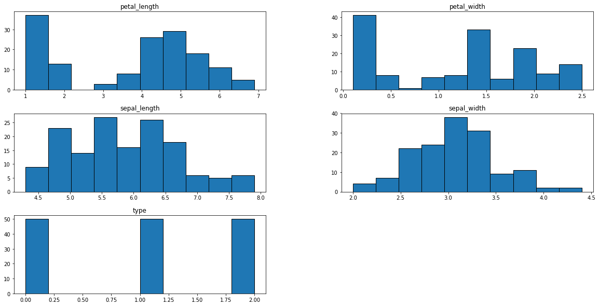
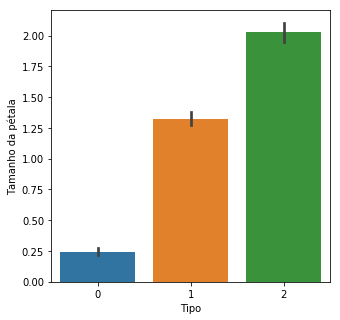
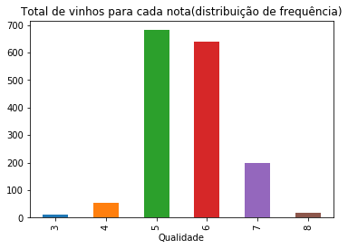
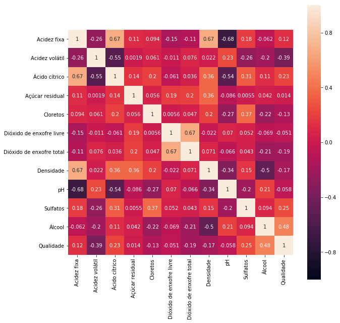
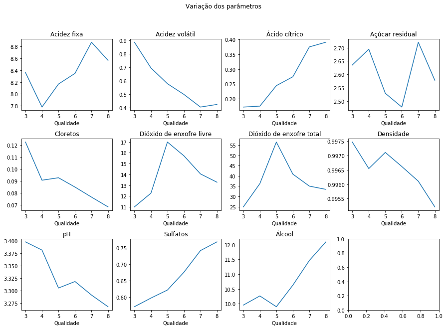
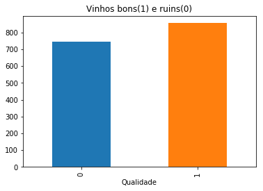
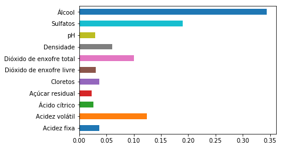
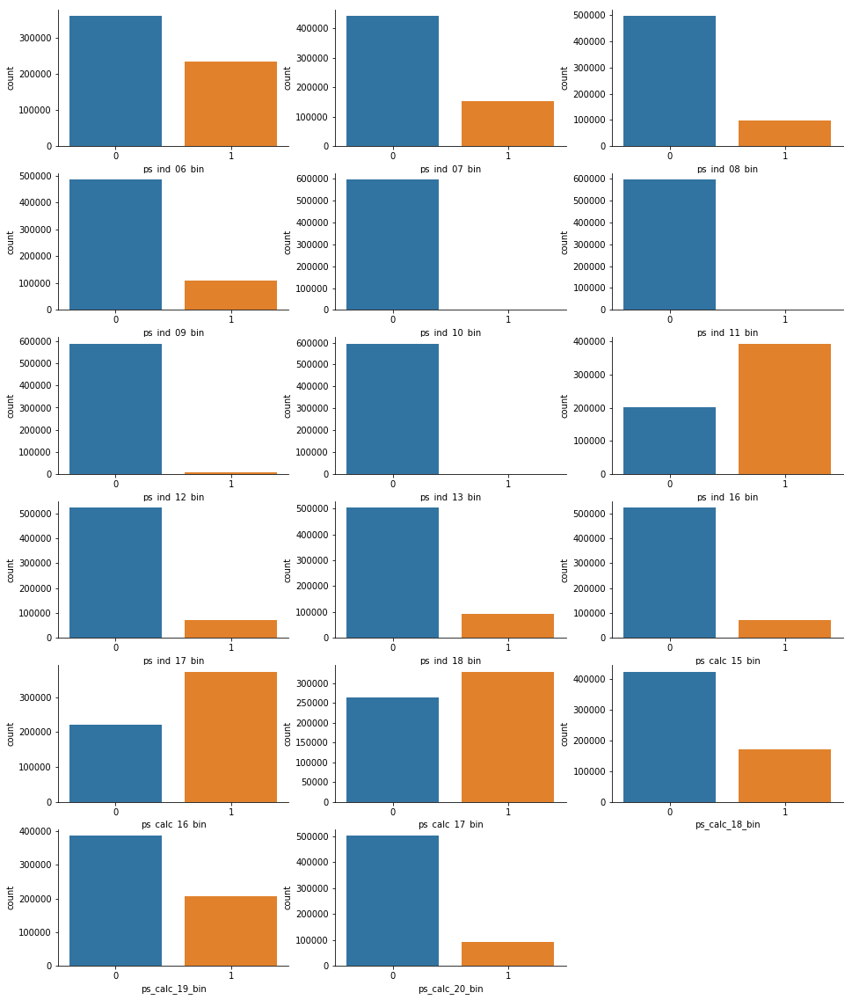
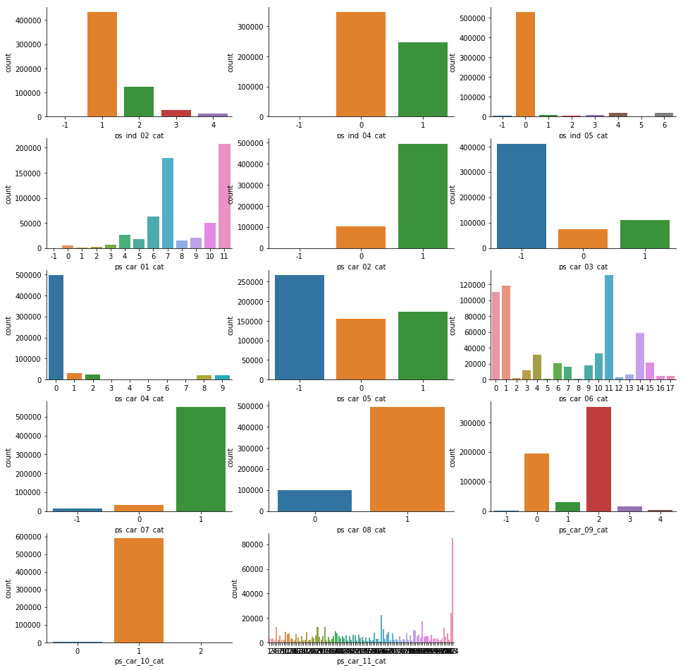
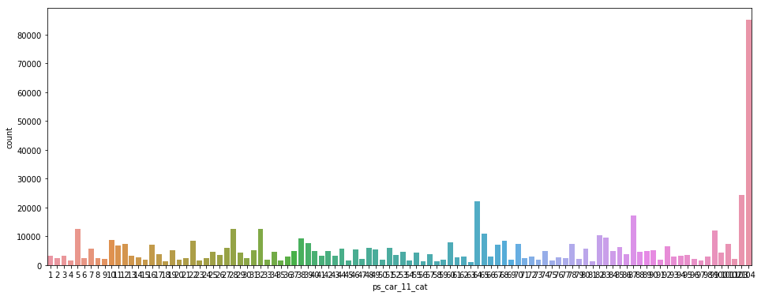

# Aula 2:  Análise Exploratória de Dados

<strong>EDA (<i>Exploratory Data Analysis</i>)</strong>

- Análise exploratória de um conjunto de dados (dataset)
- Método investigativo e exploratório
- Faz grande uso de visualizações
- Etapa inicial quando se obtém um dataset
- Ajuda na identificação de valores nulos ou vazios
- Permite conhecer a distribuição dos valores
- Possibilita formular hipóteses e desenvolver insights sobre os dados


<strong>Fonte:</strong> https://en.wikipedia.org/wiki/Exploratory_data_analysis

<br>

## Fontes de datasets

<p>List of datasets for machine learning research</p>
https://en.wikipedia.org/wiki/List_of_datasets_for_machine_learning_research


<p>UCI Machine Learning Repository</p>
https://archive.ics.uci.edu/ml/datasets.html


<p>Kaggle Datasets</p>
https://www.kaggle.com/datasets

<p>Google Dataset Search (Beta)</p>
https://toolbox.google.com/datasetsearch

<br>

## Datasets clássicos

<strong>MNIST:</strong> dígitos escritos à mão. 70 mil imagens em 10 classes.
<br>

<strong>ImageNet:</strong> aproximadamente 1.500.000 imagens, associadas às suas descrições.
<br>

<strong>CIFAR-10:</strong> 60.000 imagens em 10 classes.
<br>

<strong>IMDB Reviews:</strong> 25.000 reviews de filmes para treino e 25.000 para teste de análise de sentimentos.<br>

<strong>Twenty Newsgroups:</strong> 20.000 mensagens de 20 grupos de notícias.<br><br>

<strong>Fonte:</strong> https://www.analyticsvidhya.com/blog/2018/03/comprehensive-collection-deep-learning-datasets/

## Iris dataset

<p>Dataset "hello world" para machine learning:</p>
<a href="https://archive.ics.uci.edu/ml/datasets/iris">https://archive.ics.uci.edu/ml/datasets/iris</a>


<strong>Fonte:</strong> https://rpubs.com/wjholst/322258


```python
import numpy as np
import pandas as pd
```


```python
# Carrega o dataset a partir do scikit
from sklearn import datasets

iris = datasets.load_iris()
iris
```


    {'DESCR': 'Iris Plants Database\n====================\n\nNotes\n-----\nData Set Characteristics:\n    :Number of Instances: 150 (50 in each of three classes)\n    :Number of Attributes: 4 numeric, predictive attributes and the class\n    :Attribute Information:\n        - sepal length in cm\n        - sepal width in cm\n        - petal length in cm\n        - petal width in cm\n        - class:\n                - Iris-Setosa\n                - Iris-Versicolour\n                - Iris-Virginica\n    :Summary Statistics:\n\n    ============== ==== ==== ======= ===== ====================\n                    Min  Max   Mean    SD   Class Correlation\n    ============== ==== ==== ======= ===== ====================\n    sepal length:   4.3  7.9   5.84   0.83    0.7826\n    sepal width:    2.0  4.4   3.05   0.43   -0.4194\n    petal length:   1.0  6.9   3.76   1.76    0.9490  (high!)\n    petal width:    0.1  2.5   1.20  0.76     0.9565  (high!)\n    ============== ==== ==== ======= ===== ====================\n\n    :Missing Attribute Values: None\n    :Class Distribution: 33.3% for each of 3 classes.\n    :Creator: R.A. Fisher\n    :Donor: Michael Marshall (MARSHALL%PLU@io.arc.nasa.gov)\n    :Date: July, 1988\n\nThis is a copy of UCI ML iris datasets.\nhttp://archive.ics.uci.edu/ml/datasets/Iris\n\nThe famous Iris database, first used by Sir R.A Fisher\n\nThis is perhaps the best known database to be found in the\npattern recognition literature.  Fisher\'s paper is a classic in the field and\nis referenced frequently to this day.  (See Duda & Hart, for example.)  The\ndata set contains 3 classes of 50 instances each, where each class refers to a\ntype of iris plant.  One class is linearly separable from the other 2; the\nlatter are NOT linearly separable from each other.\n\nReferences\n----------\n   - Fisher,R.A. "The use of multiple measurements in taxonomic problems"\n     Annual Eugenics, 7, Part II, 179-188 (1936); also in "Contributions to\n     Mathematical Statistics" (John Wiley, NY, 1950).\n   - Duda,R.O., & Hart,P.E. (1973) Pattern Classification and Scene Analysis.\n     (Q327.D83) John Wiley & Sons.  ISBN 0-471-22361-1.  See page 218.\n   - Dasarathy, B.V. (1980) "Nosing Around the Neighborhood: A New System\n     Structure and Classification Rule for Recognition in Partially Exposed\n     Environments".  IEEE Transactions on Pattern Analysis and Machine\n     Intelligence, Vol. PAMI-2, No. 1, 67-71.\n   - Gates, G.W. (1972) "The Reduced Nearest Neighbor Rule".  IEEE Transactions\n     on Information Theory, May 1972, 431-433.\n   - See also: 1988 MLC Proceedings, 54-64.  Cheeseman et al"s AUTOCLASS II\n     conceptual clustering system finds 3 classes in the data.\n   - Many, many more ...\n',
     'data': array([[5.1, 3.5, 1.4, 0.2],
            [4.9, 3. , 1.4, 0.2],
            [4.7, 3.2, 1.3, 0.2],
            [4.6, 3.1, 1.5, 0.2],
            [5. , 3.6, 1.4, 0.2],
            [5.4, 3.9, 1.7, 0.4],
            [4.6, 3.4, 1.4, 0.3],
            [5. , 3.4, 1.5, 0.2],
            [4.4, 2.9, 1.4, 0.2],
            [4.9, 3.1, 1.5, 0.1],
            [5.4, 3.7, 1.5, 0.2],
            [4.8, 3.4, 1.6, 0.2],
            [4.8, 3. , 1.4, 0.1],
            [4.3, 3. , 1.1, 0.1],
            [5.8, 4. , 1.2, 0.2],
            [5.7, 4.4, 1.5, 0.4],
            [5.4, 3.9, 1.3, 0.4],
            [5.1, 3.5, 1.4, 0.3],
            [5.7, 3.8, 1.7, 0.3],
            [5.1, 3.8, 1.5, 0.3],
            [5.4, 3.4, 1.7, 0.2],
            [5.1, 3.7, 1.5, 0.4],
            [4.6, 3.6, 1. , 0.2],
            [5.1, 3.3, 1.7, 0.5],
            [4.8, 3.4, 1.9, 0.2],
            [5. , 3. , 1.6, 0.2],
            [5. , 3.4, 1.6, 0.4],
            [5.2, 3.5, 1.5, 0.2],
            [5.2, 3.4, 1.4, 0.2],
            [4.7, 3.2, 1.6, 0.2],
            [4.8, 3.1, 1.6, 0.2],
            [5.4, 3.4, 1.5, 0.4],
            [5.2, 4.1, 1.5, 0.1],
            [5.5, 4.2, 1.4, 0.2],
            [4.9, 3.1, 1.5, 0.1],
            [5. , 3.2, 1.2, 0.2],
            [5.5, 3.5, 1.3, 0.2],
            [4.9, 3.1, 1.5, 0.1],
            [4.4, 3. , 1.3, 0.2],
            [5.1, 3.4, 1.5, 0.2],
            [5. , 3.5, 1.3, 0.3],
            [4.5, 2.3, 1.3, 0.3],
            [4.4, 3.2, 1.3, 0.2],
            [5. , 3.5, 1.6, 0.6],
            [5.1, 3.8, 1.9, 0.4],
            [4.8, 3. , 1.4, 0.3],
            [5.1, 3.8, 1.6, 0.2],
            [4.6, 3.2, 1.4, 0.2],
            [5.3, 3.7, 1.5, 0.2],
            [5. , 3.3, 1.4, 0.2],
            [7. , 3.2, 4.7, 1.4],
            [6.4, 3.2, 4.5, 1.5],
            [6.9, 3.1, 4.9, 1.5],
            [5.5, 2.3, 4. , 1.3],
            [6.5, 2.8, 4.6, 1.5],
            [5.7, 2.8, 4.5, 1.3],
            [6.3, 3.3, 4.7, 1.6],
            [4.9, 2.4, 3.3, 1. ],
            [6.6, 2.9, 4.6, 1.3],
            [5.2, 2.7, 3.9, 1.4],
            [5. , 2. , 3.5, 1. ],
            [5.9, 3. , 4.2, 1.5],
            [6. , 2.2, 4. , 1. ],
            [6.1, 2.9, 4.7, 1.4],
            [5.6, 2.9, 3.6, 1.3],
            [6.7, 3.1, 4.4, 1.4],
            [5.6, 3. , 4.5, 1.5],
            [5.8, 2.7, 4.1, 1. ],
            [6.2, 2.2, 4.5, 1.5],
            [5.6, 2.5, 3.9, 1.1],
            [5.9, 3.2, 4.8, 1.8],
            [6.1, 2.8, 4. , 1.3],
            [6.3, 2.5, 4.9, 1.5],
            [6.1, 2.8, 4.7, 1.2],
            [6.4, 2.9, 4.3, 1.3],
            [6.6, 3. , 4.4, 1.4],
            [6.8, 2.8, 4.8, 1.4],
            [6.7, 3. , 5. , 1.7],
            [6. , 2.9, 4.5, 1.5],
            [5.7, 2.6, 3.5, 1. ],
            [5.5, 2.4, 3.8, 1.1],
            [5.5, 2.4, 3.7, 1. ],
            [5.8, 2.7, 3.9, 1.2],
            [6. , 2.7, 5.1, 1.6],
            [5.4, 3. , 4.5, 1.5],
            [6. , 3.4, 4.5, 1.6],
            [6.7, 3.1, 4.7, 1.5],
            [6.3, 2.3, 4.4, 1.3],
            [5.6, 3. , 4.1, 1.3],
            [5.5, 2.5, 4. , 1.3],
            [5.5, 2.6, 4.4, 1.2],
            [6.1, 3. , 4.6, 1.4],
            [5.8, 2.6, 4. , 1.2],
            [5. , 2.3, 3.3, 1. ],
            [5.6, 2.7, 4.2, 1.3],
            [5.7, 3. , 4.2, 1.2],
            [5.7, 2.9, 4.2, 1.3],
            [6.2, 2.9, 4.3, 1.3],
            [5.1, 2.5, 3. , 1.1],
            [5.7, 2.8, 4.1, 1.3],
            [6.3, 3.3, 6. , 2.5],
            [5.8, 2.7, 5.1, 1.9],
            [7.1, 3. , 5.9, 2.1],
            [6.3, 2.9, 5.6, 1.8],
            [6.5, 3. , 5.8, 2.2],
            [7.6, 3. , 6.6, 2.1],
            [4.9, 2.5, 4.5, 1.7],
            [7.3, 2.9, 6.3, 1.8],
            [6.7, 2.5, 5.8, 1.8],
            [7.2, 3.6, 6.1, 2.5],
            [6.5, 3.2, 5.1, 2. ],
            [6.4, 2.7, 5.3, 1.9],
            [6.8, 3. , 5.5, 2.1],
            [5.7, 2.5, 5. , 2. ],
            [5.8, 2.8, 5.1, 2.4],
            [6.4, 3.2, 5.3, 2.3],
            [6.5, 3. , 5.5, 1.8],
            [7.7, 3.8, 6.7, 2.2],
            [7.7, 2.6, 6.9, 2.3],
            [6. , 2.2, 5. , 1.5],
            [6.9, 3.2, 5.7, 2.3],
            [5.6, 2.8, 4.9, 2. ],
            [7.7, 2.8, 6.7, 2. ],
            [6.3, 2.7, 4.9, 1.8],
            [6.7, 3.3, 5.7, 2.1],
            [7.2, 3.2, 6. , 1.8],
            [6.2, 2.8, 4.8, 1.8],
            [6.1, 3. , 4.9, 1.8],
            [6.4, 2.8, 5.6, 2.1],
            [7.2, 3. , 5.8, 1.6],
            [7.4, 2.8, 6.1, 1.9],
            [7.9, 3.8, 6.4, 2. ],
            [6.4, 2.8, 5.6, 2.2],
            [6.3, 2.8, 5.1, 1.5],
            [6.1, 2.6, 5.6, 1.4],
            [7.7, 3. , 6.1, 2.3],
            [6.3, 3.4, 5.6, 2.4],
            [6.4, 3.1, 5.5, 1.8],
            [6. , 3. , 4.8, 1.8],
            [6.9, 3.1, 5.4, 2.1],
            [6.7, 3.1, 5.6, 2.4],
            [6.9, 3.1, 5.1, 2.3],
            [5.8, 2.7, 5.1, 1.9],
            [6.8, 3.2, 5.9, 2.3],
            [6.7, 3.3, 5.7, 2.5],
            [6.7, 3. , 5.2, 2.3],
            [6.3, 2.5, 5. , 1.9],
            [6.5, 3. , 5.2, 2. ],
            [6.2, 3.4, 5.4, 2.3],
            [5.9, 3. , 5.1, 1.8]]),
     'feature_names': ['sepal length (cm)',
      'sepal width (cm)',
      'petal length (cm)',
      'petal width (cm)'],
     'target': array([0, 0, 0, 0, 0, 0, 0, 0, 0, 0, 0, 0, 0, 0, 0, 0, 0, 0, 0, 0, 0, 0,
            0, 0, 0, 0, 0, 0, 0, 0, 0, 0, 0, 0, 0, 0, 0, 0, 0, 0, 0, 0, 0, 0,
            0, 0, 0, 0, 0, 0, 1, 1, 1, 1, 1, 1, 1, 1, 1, 1, 1, 1, 1, 1, 1, 1,
            1, 1, 1, 1, 1, 1, 1, 1, 1, 1, 1, 1, 1, 1, 1, 1, 1, 1, 1, 1, 1, 1,
            1, 1, 1, 1, 1, 1, 1, 1, 1, 1, 1, 1, 2, 2, 2, 2, 2, 2, 2, 2, 2, 2,
            2, 2, 2, 2, 2, 2, 2, 2, 2, 2, 2, 2, 2, 2, 2, 2, 2, 2, 2, 2, 2, 2,
            2, 2, 2, 2, 2, 2, 2, 2, 2, 2, 2, 2, 2, 2, 2, 2, 2, 2]),
     'target_names': array(['setosa', 'versicolor', 'virginica'], dtype='<U10')}


```python
iris.data
```


    array([[5.1, 3.5, 1.4, 0.2],
           [4.9, 3. , 1.4, 0.2],
           [4.7, 3.2, 1.3, 0.2],
           [4.6, 3.1, 1.5, 0.2],
           [5. , 3.6, 1.4, 0.2],
           [5.4, 3.9, 1.7, 0.4],
           [4.6, 3.4, 1.4, 0.3],
           [5. , 3.4, 1.5, 0.2],
           [4.4, 2.9, 1.4, 0.2],
           [4.9, 3.1, 1.5, 0.1],
           [5.4, 3.7, 1.5, 0.2],
           [4.8, 3.4, 1.6, 0.2],
           [4.8, 3. , 1.4, 0.1],
           [4.3, 3. , 1.1, 0.1],
           [5.8, 4. , 1.2, 0.2],
           [5.7, 4.4, 1.5, 0.4],
           [5.4, 3.9, 1.3, 0.4],
           [5.1, 3.5, 1.4, 0.3],
           [5.7, 3.8, 1.7, 0.3],
           [5.1, 3.8, 1.5, 0.3],
           [5.4, 3.4, 1.7, 0.2],
           [5.1, 3.7, 1.5, 0.4],
           [4.6, 3.6, 1. , 0.2],
           [5.1, 3.3, 1.7, 0.5],
           [4.8, 3.4, 1.9, 0.2],
           [5. , 3. , 1.6, 0.2],
           [5. , 3.4, 1.6, 0.4],
           [5.2, 3.5, 1.5, 0.2],
           [5.2, 3.4, 1.4, 0.2],
           [4.7, 3.2, 1.6, 0.2],
           [4.8, 3.1, 1.6, 0.2],
           [5.4, 3.4, 1.5, 0.4],
           [5.2, 4.1, 1.5, 0.1],
           [5.5, 4.2, 1.4, 0.2],
           [4.9, 3.1, 1.5, 0.1],
           [5. , 3.2, 1.2, 0.2],
           [5.5, 3.5, 1.3, 0.2],
           [4.9, 3.1, 1.5, 0.1],
           [4.4, 3. , 1.3, 0.2],
           [5.1, 3.4, 1.5, 0.2],
           [5. , 3.5, 1.3, 0.3],
           [4.5, 2.3, 1.3, 0.3],
           [4.4, 3.2, 1.3, 0.2],
           [5. , 3.5, 1.6, 0.6],
           [5.1, 3.8, 1.9, 0.4],
           [4.8, 3. , 1.4, 0.3],
           [5.1, 3.8, 1.6, 0.2],
           [4.6, 3.2, 1.4, 0.2],
           [5.3, 3.7, 1.5, 0.2],
           [5. , 3.3, 1.4, 0.2],
           [7. , 3.2, 4.7, 1.4],
           [6.4, 3.2, 4.5, 1.5],
           [6.9, 3.1, 4.9, 1.5],
           [5.5, 2.3, 4. , 1.3],
           [6.5, 2.8, 4.6, 1.5],
           [5.7, 2.8, 4.5, 1.3],
           [6.3, 3.3, 4.7, 1.6],
           [4.9, 2.4, 3.3, 1. ],
           [6.6, 2.9, 4.6, 1.3],
           [5.2, 2.7, 3.9, 1.4],
           [5. , 2. , 3.5, 1. ],
           [5.9, 3. , 4.2, 1.5],
           [6. , 2.2, 4. , 1. ],
           [6.1, 2.9, 4.7, 1.4],
           [5.6, 2.9, 3.6, 1.3],
           [6.7, 3.1, 4.4, 1.4],
           [5.6, 3. , 4.5, 1.5],
           [5.8, 2.7, 4.1, 1. ],
           [6.2, 2.2, 4.5, 1.5],
           [5.6, 2.5, 3.9, 1.1],
           [5.9, 3.2, 4.8, 1.8],
           [6.1, 2.8, 4. , 1.3],
           [6.3, 2.5, 4.9, 1.5],
           [6.1, 2.8, 4.7, 1.2],
           [6.4, 2.9, 4.3, 1.3],
           [6.6, 3. , 4.4, 1.4],
           [6.8, 2.8, 4.8, 1.4],
           [6.7, 3. , 5. , 1.7],
           [6. , 2.9, 4.5, 1.5],
           [5.7, 2.6, 3.5, 1. ],
           [5.5, 2.4, 3.8, 1.1],
           [5.5, 2.4, 3.7, 1. ],
           [5.8, 2.7, 3.9, 1.2],
           [6. , 2.7, 5.1, 1.6],
           [5.4, 3. , 4.5, 1.5],
           [6. , 3.4, 4.5, 1.6],
           [6.7, 3.1, 4.7, 1.5],
           [6.3, 2.3, 4.4, 1.3],
           [5.6, 3. , 4.1, 1.3],
           [5.5, 2.5, 4. , 1.3],
           [5.5, 2.6, 4.4, 1.2],
           [6.1, 3. , 4.6, 1.4],
           [5.8, 2.6, 4. , 1.2],
           [5. , 2.3, 3.3, 1. ],
           [5.6, 2.7, 4.2, 1.3],
           [5.7, 3. , 4.2, 1.2],
           [5.7, 2.9, 4.2, 1.3],
           [6.2, 2.9, 4.3, 1.3],
           [5.1, 2.5, 3. , 1.1],
           [5.7, 2.8, 4.1, 1.3],
           [6.3, 3.3, 6. , 2.5],
           [5.8, 2.7, 5.1, 1.9],
           [7.1, 3. , 5.9, 2.1],
           [6.3, 2.9, 5.6, 1.8],
           [6.5, 3. , 5.8, 2.2],
           [7.6, 3. , 6.6, 2.1],
           [4.9, 2.5, 4.5, 1.7],
           [7.3, 2.9, 6.3, 1.8],
           [6.7, 2.5, 5.8, 1.8],
           [7.2, 3.6, 6.1, 2.5],
           [6.5, 3.2, 5.1, 2. ],
           [6.4, 2.7, 5.3, 1.9],
           [6.8, 3. , 5.5, 2.1],
           [5.7, 2.5, 5. , 2. ],
           [5.8, 2.8, 5.1, 2.4],
           [6.4, 3.2, 5.3, 2.3],
           [6.5, 3. , 5.5, 1.8],
           [7.7, 3.8, 6.7, 2.2],
           [7.7, 2.6, 6.9, 2.3],
           [6. , 2.2, 5. , 1.5],
           [6.9, 3.2, 5.7, 2.3],
           [5.6, 2.8, 4.9, 2. ],
           [7.7, 2.8, 6.7, 2. ],
           [6.3, 2.7, 4.9, 1.8],
           [6.7, 3.3, 5.7, 2.1],
           [7.2, 3.2, 6. , 1.8],
           [6.2, 2.8, 4.8, 1.8],
           [6.1, 3. , 4.9, 1.8],
           [6.4, 2.8, 5.6, 2.1],
           [7.2, 3. , 5.8, 1.6],
           [7.4, 2.8, 6.1, 1.9],
           [7.9, 3.8, 6.4, 2. ],
           [6.4, 2.8, 5.6, 2.2],
           [6.3, 2.8, 5.1, 1.5],
           [6.1, 2.6, 5.6, 1.4],
           [7.7, 3. , 6.1, 2.3],
           [6.3, 3.4, 5.6, 2.4],
           [6.4, 3.1, 5.5, 1.8],
           [6. , 3. , 4.8, 1.8],
           [6.9, 3.1, 5.4, 2.1],
           [6.7, 3.1, 5.6, 2.4],
           [6.9, 3.1, 5.1, 2.3],
           [5.8, 2.7, 5.1, 1.9],
           [6.8, 3.2, 5.9, 2.3],
           [6.7, 3.3, 5.7, 2.5],
           [6.7, 3. , 5.2, 2.3],
           [6.3, 2.5, 5. , 1.9],
           [6.5, 3. , 5.2, 2. ],
           [6.2, 3.4, 5.4, 2.3],
           [5.9, 3. , 5.1, 1.8]])


```python
iris.target
```


    array([0, 0, 0, 0, 0, 0, 0, 0, 0, 0, 0, 0, 0, 0, 0, 0, 0, 0, 0, 0, 0, 0,
           0, 0, 0, 0, 0, 0, 0, 0, 0, 0, 0, 0, 0, 0, 0, 0, 0, 0, 0, 0, 0, 0,
           0, 0, 0, 0, 0, 0, 1, 1, 1, 1, 1, 1, 1, 1, 1, 1, 1, 1, 1, 1, 1, 1,
           1, 1, 1, 1, 1, 1, 1, 1, 1, 1, 1, 1, 1, 1, 1, 1, 1, 1, 1, 1, 1, 1,
           1, 1, 1, 1, 1, 1, 1, 1, 1, 1, 1, 1, 2, 2, 2, 2, 2, 2, 2, 2, 2, 2,
           2, 2, 2, 2, 2, 2, 2, 2, 2, 2, 2, 2, 2, 2, 2, 2, 2, 2, 2, 2, 2, 2,
           2, 2, 2, 2, 2, 2, 2, 2, 2, 2, 2, 2, 2, 2, 2, 2, 2, 2])


```python
# Transforma o dataset em um DataFrame Pandas
df_iris = pd.DataFrame(iris.data)
df_iris['target'] = iris.target

df_iris.head()
```


<div>
<style scoped>
    .dataframe tbody tr th:only-of-type {
        vertical-align: middle;
    }

    .dataframe tbody tr th {
        vertical-align: top;
    }

    .dataframe thead th {
        text-align: right;
    }
</style>
<table border="1" class="dataframe">
  <thead>
    <tr style="text-align: right;">
      <th></th>
      <th>0</th>
      <th>1</th>
      <th>2</th>
      <th>3</th>
      <th>target</th>
    </tr>
  </thead>
  <tbody>
    <tr>
      <th>0</th>
      <td>5.1</td>
      <td>3.5</td>
      <td>1.4</td>
      <td>0.2</td>
      <td>0</td>
    </tr>
    <tr>
      <th>1</th>
      <td>4.9</td>
      <td>3.0</td>
      <td>1.4</td>
      <td>0.2</td>
      <td>0</td>
    </tr>
    <tr>
      <th>2</th>
      <td>4.7</td>
      <td>3.2</td>
      <td>1.3</td>
      <td>0.2</td>
      <td>0</td>
    </tr>
    <tr>
      <th>3</th>
      <td>4.6</td>
      <td>3.1</td>
      <td>1.5</td>
      <td>0.2</td>
      <td>0</td>
    </tr>
    <tr>
      <th>4</th>
      <td>5.0</td>
      <td>3.6</td>
      <td>1.4</td>
      <td>0.2</td>
      <td>0</td>
    </tr>
  </tbody>
</table>
</div>


```python
# Nome das colunas
df_iris.columns.tolist()
```


    [0, 1, 2, 3, 'target']


```python
# Alterando o nome das coluna
df_iris.columns = ['sepal_length', 'sepal_width', 'petal_length', 'petal_width', 'type']
df_iris.head(10)
```


<div>
<style scoped>
    .dataframe tbody tr th:only-of-type {
        vertical-align: middle;
    }

    .dataframe tbody tr th {
        vertical-align: top;
    }

    .dataframe thead th {
        text-align: right;
    }
</style>
<table border="1" class="dataframe">
  <thead>
    <tr style="text-align: right;">
      <th></th>
      <th>sepal_length</th>
      <th>sepal_width</th>
      <th>petal_length</th>
      <th>petal_width</th>
      <th>type</th>
    </tr>
  </thead>
  <tbody>
    <tr>
      <th>0</th>
      <td>5.1</td>
      <td>3.5</td>
      <td>1.4</td>
      <td>0.2</td>
      <td>0</td>
    </tr>
    <tr>
      <th>1</th>
      <td>4.9</td>
      <td>3.0</td>
      <td>1.4</td>
      <td>0.2</td>
      <td>0</td>
    </tr>
    <tr>
      <th>2</th>
      <td>4.7</td>
      <td>3.2</td>
      <td>1.3</td>
      <td>0.2</td>
      <td>0</td>
    </tr>
    <tr>
      <th>3</th>
      <td>4.6</td>
      <td>3.1</td>
      <td>1.5</td>
      <td>0.2</td>
      <td>0</td>
    </tr>
    <tr>
      <th>4</th>
      <td>5.0</td>
      <td>3.6</td>
      <td>1.4</td>
      <td>0.2</td>
      <td>0</td>
    </tr>
    <tr>
      <th>5</th>
      <td>5.4</td>
      <td>3.9</td>
      <td>1.7</td>
      <td>0.4</td>
      <td>0</td>
    </tr>
    <tr>
      <th>6</th>
      <td>4.6</td>
      <td>3.4</td>
      <td>1.4</td>
      <td>0.3</td>
      <td>0</td>
    </tr>
    <tr>
      <th>7</th>
      <td>5.0</td>
      <td>3.4</td>
      <td>1.5</td>
      <td>0.2</td>
      <td>0</td>
    </tr>
    <tr>
      <th>8</th>
      <td>4.4</td>
      <td>2.9</td>
      <td>1.4</td>
      <td>0.2</td>
      <td>0</td>
    </tr>
    <tr>
      <th>9</th>
      <td>4.9</td>
      <td>3.1</td>
      <td>1.5</td>
      <td>0.1</td>
      <td>0</td>
    </tr>
  </tbody>
</table>
</div>


```python
# Tamanho do dataset
df_iris.shape
```


    (150, 5)


```python
# Acessando uma coluna
df_iris['sepal_length'].head()
```


    0    5.1
    1    4.9
    2    4.7
    3    4.6
    4    5.0
    Name: sepal_length, dtype: float64


```python
# Ou
df_iris.sepal_length.head()
```


    0    5.1
    1    4.9
    2    4.7
    3    4.6
    4    5.0
    Name: sepal_length, dtype: float64


```python
# Selecionando mais de uma coluna
df_iris[['sepal_length', 'petal_length']].head()
```


<div>
<style scoped>
    .dataframe tbody tr th:only-of-type {
        vertical-align: middle;
    }

    .dataframe tbody tr th {
        vertical-align: top;
    }

    .dataframe thead th {
        text-align: right;
    }
</style>
<table border="1" class="dataframe">
  <thead>
    <tr style="text-align: right;">
      <th></th>
      <th>sepal_length</th>
      <th>petal_length</th>
    </tr>
  </thead>
  <tbody>
    <tr>
      <th>0</th>
      <td>5.1</td>
      <td>1.4</td>
    </tr>
    <tr>
      <th>1</th>
      <td>4.9</td>
      <td>1.4</td>
    </tr>
    <tr>
      <th>2</th>
      <td>4.7</td>
      <td>1.3</td>
    </tr>
    <tr>
      <th>3</th>
      <td>4.6</td>
      <td>1.5</td>
    </tr>
    <tr>
      <th>4</th>
      <td>5.0</td>
      <td>1.4</td>
    </tr>
  </tbody>
</table>
</div>


```python
# Removendo uma coluna
# Notação Pandas para os eixos (axis):
# Linhas: axis 0
# Colunas: axis 1
df_iris.drop(['type'], axis=1).head()
```


<div>
<style scoped>
    .dataframe tbody tr th:only-of-type {
        vertical-align: middle;
    }

    .dataframe tbody tr th {
        vertical-align: top;
    }

    .dataframe thead th {
        text-align: right;
    }
</style>
<table border="1" class="dataframe">
  <thead>
    <tr style="text-align: right;">
      <th></th>
      <th>sepal_length</th>
      <th>sepal_width</th>
      <th>petal_length</th>
      <th>petal_width</th>
    </tr>
  </thead>
  <tbody>
    <tr>
      <th>0</th>
      <td>5.1</td>
      <td>3.5</td>
      <td>1.4</td>
      <td>0.2</td>
    </tr>
    <tr>
      <th>1</th>
      <td>4.9</td>
      <td>3.0</td>
      <td>1.4</td>
      <td>0.2</td>
    </tr>
    <tr>
      <th>2</th>
      <td>4.7</td>
      <td>3.2</td>
      <td>1.3</td>
      <td>0.2</td>
    </tr>
    <tr>
      <th>3</th>
      <td>4.6</td>
      <td>3.1</td>
      <td>1.5</td>
      <td>0.2</td>
    </tr>
    <tr>
      <th>4</th>
      <td>5.0</td>
      <td>3.6</td>
      <td>1.4</td>
      <td>0.2</td>
    </tr>
  </tbody>
</table>
</div>


```python
# Tipos únicos
df_iris['type'].unique()
```


    array([0, 1, 2])


```python
# Associando o nome ao tipo
df_iris['type'].map({
    0: 'Setosa',
    1: 'Versicolour',
    2: 'Virginica'
})
```


    0         Setosa
    1         Setosa
    2         Setosa
    3         Setosa
    4         Setosa
    5         Setosa
    6         Setosa
    7         Setosa
    8         Setosa
    9         Setosa
    10        Setosa
    11        Setosa
    12        Setosa
    13        Setosa
    14        Setosa
    15        Setosa
    16        Setosa
    17        Setosa
    18        Setosa
    19        Setosa
    20        Setosa
    21        Setosa
    22        Setosa
    23        Setosa
    24        Setosa
    25        Setosa
    26        Setosa
    27        Setosa
    28        Setosa
    29        Setosa
             ...    
    120    Virginica
    121    Virginica
    122    Virginica
    123    Virginica
    124    Virginica
    125    Virginica
    126    Virginica
    127    Virginica
    128    Virginica
    129    Virginica
    130    Virginica
    131    Virginica
    132    Virginica
    133    Virginica
    134    Virginica
    135    Virginica
    136    Virginica
    137    Virginica
    138    Virginica
    139    Virginica
    140    Virginica
    141    Virginica
    142    Virginica
    143    Virginica
    144    Virginica
    145    Virginica
    146    Virginica
    147    Virginica
    148    Virginica
    149    Virginica
    Name: type, Length: 150, dtype: object


```python
# Filtrando por tipo
df_iris[df_iris['type'] == 2].head()
```


<div>
<style scoped>
    .dataframe tbody tr th:only-of-type {
        vertical-align: middle;
    }

    .dataframe tbody tr th {
        vertical-align: top;
    }

    .dataframe thead th {
        text-align: right;
    }
</style>
<table border="1" class="dataframe">
  <thead>
    <tr style="text-align: right;">
      <th></th>
      <th>sepal_length</th>
      <th>sepal_width</th>
      <th>petal_length</th>
      <th>petal_width</th>
      <th>type</th>
    </tr>
  </thead>
  <tbody>
    <tr>
      <th>100</th>
      <td>6.3</td>
      <td>3.3</td>
      <td>6.0</td>
      <td>2.5</td>
      <td>2</td>
    </tr>
    <tr>
      <th>101</th>
      <td>5.8</td>
      <td>2.7</td>
      <td>5.1</td>
      <td>1.9</td>
      <td>2</td>
    </tr>
    <tr>
      <th>102</th>
      <td>7.1</td>
      <td>3.0</td>
      <td>5.9</td>
      <td>2.1</td>
      <td>2</td>
    </tr>
    <tr>
      <th>103</th>
      <td>6.3</td>
      <td>2.9</td>
      <td>5.6</td>
      <td>1.8</td>
      <td>2</td>
    </tr>
    <tr>
      <th>104</th>
      <td>6.5</td>
      <td>3.0</td>
      <td>5.8</td>
      <td>2.2</td>
      <td>2</td>
    </tr>
  </tbody>
</table>
</div>


```python
# Filtrando por tamanho da pétala
df_iris[df_iris['petal_length'] > 5].head()
```


<div>
<style scoped>
    .dataframe tbody tr th:only-of-type {
        vertical-align: middle;
    }

    .dataframe tbody tr th {
        vertical-align: top;
    }

    .dataframe thead th {
        text-align: right;
    }
</style>
<table border="1" class="dataframe">
  <thead>
    <tr style="text-align: right;">
      <th></th>
      <th>sepal_length</th>
      <th>sepal_width</th>
      <th>petal_length</th>
      <th>petal_width</th>
      <th>type</th>
    </tr>
  </thead>
  <tbody>
    <tr>
      <th>83</th>
      <td>6.0</td>
      <td>2.7</td>
      <td>5.1</td>
      <td>1.6</td>
      <td>1</td>
    </tr>
    <tr>
      <th>100</th>
      <td>6.3</td>
      <td>3.3</td>
      <td>6.0</td>
      <td>2.5</td>
      <td>2</td>
    </tr>
    <tr>
      <th>101</th>
      <td>5.8</td>
      <td>2.7</td>
      <td>5.1</td>
      <td>1.9</td>
      <td>2</td>
    </tr>
    <tr>
      <th>102</th>
      <td>7.1</td>
      <td>3.0</td>
      <td>5.9</td>
      <td>2.1</td>
      <td>2</td>
    </tr>
    <tr>
      <th>103</th>
      <td>6.3</td>
      <td>2.9</td>
      <td>5.6</td>
      <td>1.8</td>
      <td>2</td>
    </tr>
  </tbody>
</table>
</div>


```python
# Filtrando por tipo E tamanho da pétala
df_iris[
    (df_iris['type'] == 2) & (df_iris['petal_length'] > 5)
].head()
```


<div>
<style scoped>
    .dataframe tbody tr th:only-of-type {
        vertical-align: middle;
    }

    .dataframe tbody tr th {
        vertical-align: top;
    }

    .dataframe thead th {
        text-align: right;
    }
</style>
<table border="1" class="dataframe">
  <thead>
    <tr style="text-align: right;">
      <th></th>
      <th>sepal_length</th>
      <th>sepal_width</th>
      <th>petal_length</th>
      <th>petal_width</th>
      <th>type</th>
    </tr>
  </thead>
  <tbody>
    <tr>
      <th>100</th>
      <td>6.3</td>
      <td>3.3</td>
      <td>6.0</td>
      <td>2.5</td>
      <td>2</td>
    </tr>
    <tr>
      <th>101</th>
      <td>5.8</td>
      <td>2.7</td>
      <td>5.1</td>
      <td>1.9</td>
      <td>2</td>
    </tr>
    <tr>
      <th>102</th>
      <td>7.1</td>
      <td>3.0</td>
      <td>5.9</td>
      <td>2.1</td>
      <td>2</td>
    </tr>
    <tr>
      <th>103</th>
      <td>6.3</td>
      <td>2.9</td>
      <td>5.6</td>
      <td>1.8</td>
      <td>2</td>
    </tr>
    <tr>
      <th>104</th>
      <td>6.5</td>
      <td>3.0</td>
      <td>5.8</td>
      <td>2.2</td>
      <td>2</td>
    </tr>
  </tbody>
</table>
</div>


```python
# Tamanho mínimo, máximo e médio da largura das pétalas
print('Menor:', df_iris['petal_width'].min())
print('Maior:', df_iris['petal_width'].max())
print('Média:', df_iris['petal_width'].mean())
```

    Menor: 0.1
    Maior: 2.5
    Média: 1.1986666666666668


```python
# Tamanho médio da largura das pétalas por tipo
for i in df_iris['type'].unique():
    print('Tipo', i)
    print(df_iris[df_iris['type'] == i]['petal_width'].mean(), '\n')
```

    Tipo 0
    0.244 
    
    Tipo 1
    1.3259999999999998 
    
    Tipo 2
    2.0260000000000002 
    


```python
# Iris com maior tamanho geral (soma das dimensões das pétalas e sépalas)
df_iris[['sepal_length', 'sepal_width', 'petal_length', 'petal_width']].sum(axis=1).max()
```


    20.4


### Atividade

Para cada tipo, encontre a iris com menor tamanho geral (soma das dimensões das pétalas e sépalas)

<br>


```python
# Aplicando transformação em uma coluna (conversão para int)
df_iris['sepal_length'].apply(lambda x: int(x)).head()
```


    0    5
    1    4
    2    4
    3    4
    4    5
    Name: sepal_length, dtype: int64


```python
# Aplicando transformação com várias colunas
df_iris.apply(lambda row: row['sepal_length'] + row['petal_length'], axis=1).head()
```


    0    6.5
    1    6.3
    2    6.0
    3    6.1
    4    6.4
    dtype: float64


```python
# Gráfico de dispersão comparando tamanho da pétala e sépala
import seaborn as sns
import matplotlib.pyplot as plt

sns.FacetGrid(
    df_iris, 
    hue='type',
    height=5
).map(
    plt.scatter, 'sepal_length', 'petal_length'
).add_legend()

plt.title('Relação entre sepal_length e petal_length')
```


    Text(0.5,1,'Relação entre sepal_length e petal_length')


```python
# Histograma
df_iris.hist(edgecolor='black', figsize=(20, 10), grid=False);
```





```python
# Tamanho da pétala por tipo
plt.figure(figsize=(5, 5))

sns.barplot(
    x=df_iris['type'], 
    y=df_iris['petal_width']
)

plt.xlabel('Tipo')
plt.ylabel('Tamanho da pétala')
plt.show()
```





### Utilizando uma rede neural para prever o tipo

Utilizaremos uma rede neural de múltiplas camadas (multilayer perceptron - MLP), com duas camadas ocultas, como na figura a seguir:


<strong>Fonte:</strong> https://www.neuraldesigner.com/learning/examples/iris_flowers_classification


```python
# Rede neural para prever o tipo (classificação)
from sklearn.neural_network import MLPClassifier

mlp = MLPClassifier(
    hidden_layer_sizes=(100, 50), 
    tol=0.01
)

# Treina a rede neural
mlp.fit(
    df_iris.drop(['type'], axis=1),
    df_iris['type']
)

# Faz uma previsão para 3 medidas de iris
mlp.predict(
    [
        [6, 5, 5, 1],
        [6, 5, 5, 10],
        [2, 2, 4, 2]
    ]
)
```


    array([1, 2, 2])


   

## Wine dataset

Descrição


```python
# Carregamento via URL
df_wine = pd.read_csv('https://raw.githubusercontent.com/rafjaa/machine_learning_fecib/master/src/wine-quality-classifier/dados/winequality-red.csv', sep=';')
df_wine.head()
```


<div>
<style scoped>
    .dataframe tbody tr th:only-of-type {
        vertical-align: middle;
    }

    .dataframe tbody tr th {
        vertical-align: top;
    }

    .dataframe thead th {
        text-align: right;
    }
</style>
<table border="1" class="dataframe">
  <thead>
    <tr style="text-align: right;">
      <th></th>
      <th>Acidez fixa</th>
      <th>Acidez volátil</th>
      <th>Ácido cítrico</th>
      <th>Açúcar residual</th>
      <th>Cloretos</th>
      <th>Dióxido de enxofre livre</th>
      <th>Dióxido de enxofre total</th>
      <th>Densidade</th>
      <th>pH</th>
      <th>Sulfatos</th>
      <th>Álcool</th>
      <th>Qualidade</th>
    </tr>
  </thead>
  <tbody>
    <tr>
      <th>0</th>
      <td>7.4</td>
      <td>0.70</td>
      <td>0.00</td>
      <td>1.9</td>
      <td>0.076</td>
      <td>11.0</td>
      <td>34.0</td>
      <td>0.9978</td>
      <td>3.51</td>
      <td>0.56</td>
      <td>9.4</td>
      <td>5</td>
    </tr>
    <tr>
      <th>1</th>
      <td>7.8</td>
      <td>0.88</td>
      <td>0.00</td>
      <td>2.6</td>
      <td>0.098</td>
      <td>25.0</td>
      <td>67.0</td>
      <td>0.9968</td>
      <td>3.20</td>
      <td>0.68</td>
      <td>9.8</td>
      <td>5</td>
    </tr>
    <tr>
      <th>2</th>
      <td>7.8</td>
      <td>0.76</td>
      <td>0.04</td>
      <td>2.3</td>
      <td>0.092</td>
      <td>15.0</td>
      <td>54.0</td>
      <td>0.9970</td>
      <td>3.26</td>
      <td>0.65</td>
      <td>9.8</td>
      <td>5</td>
    </tr>
    <tr>
      <th>3</th>
      <td>11.2</td>
      <td>0.28</td>
      <td>0.56</td>
      <td>1.9</td>
      <td>0.075</td>
      <td>17.0</td>
      <td>60.0</td>
      <td>0.9980</td>
      <td>3.16</td>
      <td>0.58</td>
      <td>9.8</td>
      <td>6</td>
    </tr>
    <tr>
      <th>4</th>
      <td>7.4</td>
      <td>0.70</td>
      <td>0.00</td>
      <td>1.9</td>
      <td>0.076</td>
      <td>11.0</td>
      <td>34.0</td>
      <td>0.9978</td>
      <td>3.51</td>
      <td>0.56</td>
      <td>9.4</td>
      <td>5</td>
    </tr>
  </tbody>
</table>
</div>


```python
# Obtém o total de vinhos para cada nota
s_wine = df_wine.groupby('Qualidade').count()['Álcool']

print('\nTotal de vinhos: ', df_wine.shape[0])

# Exibindo gráfico
s_wine.plot(kind='bar', title='Total de vinhos para cada nota(distribuição de frequência)')
```

    
    Total de vinhos:  1599


    <matplotlib.axes._subplots.AxesSubplot at 0x7f2e4bdf5588>





```python
# Matriz de correlação
corr_mat = df_wine.corr()

f, ax = plt.subplots(figsize=(10, 10))

sns.heatmap(
    corr_mat, 
    annot=True, 
    square=True, 
    vmax=1, 
    vmin=-1
)
```


    <matplotlib.axes._subplots.AxesSubplot at 0x7f2e4c120470>





```python
#Variação dos parâmetros químicos dos vinhos em relação à qualidade
df = df_wine.groupby('Qualidade').mean()

# Definindo gráficos
fig, axes = plt.subplots(nrows=3, ncols=4, figsize=(15, 10))
fig.suptitle("Variação dos parâmetros")

# Aumentando espaço entre gráficos
fig.subplots_adjust(hspace=0.4)

# Plota gráfico com média dos elementos, agrupado pela nota
for i, column in enumerate(df.columns):
    ax = axes[int(i/4)][i % 4]
    
    ax.set_title(column)
    
    df[column].plot(ax=ax)
```





```python
# Classifica as notas(3 a 5 = 0; 6 a 8 = 1)
df_wine['Qualidade'] = df_wine['Qualidade'].apply(lambda x: 0 if x < 6 else 1)

# Exibe gráfico
df_wine.groupby('Qualidade').count()['Álcool'].plot(kind='bar', title='Vinhos bons(1) e ruins(0)')
```


    <matplotlib.axes._subplots.AxesSubplot at 0x7f2e48d1f550>





```python
# Modelo de árvores para feature importance
from sklearn.ensemble import RandomForestClassifier

clf = RandomForestClassifier(
    n_estimators=50,
    max_depth=5
)

clf.fit(
    df_wine.drop(['Qualidade'], axis=1),
    df_wine['Qualidade']
)

clf.feature_importances_
```


    array([0.03683243, 0.12369198, 0.02628476, 0.02316199, 0.03633018,
           0.0304365 , 0.10022902, 0.06071549, 0.0288796 , 0.18974394,
           0.34369409])


```python
feat_importances = pd.Series(
    clf.feature_importances_, 
    index=df_wine.drop(['Qualidade'], axis=1).columns
)
feat_importances.plot(kind='barh');
```





  

## Porto Seguro’s Safe Driver Prediction

<i>Predict if a driver will file an insurance claim next year.</i><br>
https://www.kaggle.com/c/porto-seguro-safe-driver-prediction

<br>

### Download do dataset pela API Kaggle

No ambiente virtual, instalar a API:<br>
<code>pip install --user kaggle</code>

Gerar o token de acesso:<br>
https://www.kaggle.com/username/account -> "Create new API token"

Copiar o arquivo JSON gerado para:<br>
<code>~/.kaggle/kaggle.json</code>

Executar no terminal:<br>
<code>kaggle competitions download -c porto-seguro-safe-driver-prediction</code>

<br>


```python
train = pd.read_csv('train.csv')
print(train.shape)
train.head()
```

    (595212, 59)


<div>
<style scoped>
    .dataframe tbody tr th:only-of-type {
        vertical-align: middle;
    }

    .dataframe tbody tr th {
        vertical-align: top;
    }

    .dataframe thead th {
        text-align: right;
    }
</style>
<table border="1" class="dataframe">
  <thead>
    <tr style="text-align: right;">
      <th></th>
      <th>id</th>
      <th>target</th>
      <th>ps_ind_01</th>
      <th>ps_ind_02_cat</th>
      <th>ps_ind_03</th>
      <th>ps_ind_04_cat</th>
      <th>ps_ind_05_cat</th>
      <th>ps_ind_06_bin</th>
      <th>ps_ind_07_bin</th>
      <th>ps_ind_08_bin</th>
      <th>...</th>
      <th>ps_calc_11</th>
      <th>ps_calc_12</th>
      <th>ps_calc_13</th>
      <th>ps_calc_14</th>
      <th>ps_calc_15_bin</th>
      <th>ps_calc_16_bin</th>
      <th>ps_calc_17_bin</th>
      <th>ps_calc_18_bin</th>
      <th>ps_calc_19_bin</th>
      <th>ps_calc_20_bin</th>
    </tr>
  </thead>
  <tbody>
    <tr>
      <th>0</th>
      <td>7</td>
      <td>0</td>
      <td>2</td>
      <td>2</td>
      <td>5</td>
      <td>1</td>
      <td>0</td>
      <td>0</td>
      <td>1</td>
      <td>0</td>
      <td>...</td>
      <td>9</td>
      <td>1</td>
      <td>5</td>
      <td>8</td>
      <td>0</td>
      <td>1</td>
      <td>1</td>
      <td>0</td>
      <td>0</td>
      <td>1</td>
    </tr>
    <tr>
      <th>1</th>
      <td>9</td>
      <td>0</td>
      <td>1</td>
      <td>1</td>
      <td>7</td>
      <td>0</td>
      <td>0</td>
      <td>0</td>
      <td>0</td>
      <td>1</td>
      <td>...</td>
      <td>3</td>
      <td>1</td>
      <td>1</td>
      <td>9</td>
      <td>0</td>
      <td>1</td>
      <td>1</td>
      <td>0</td>
      <td>1</td>
      <td>0</td>
    </tr>
    <tr>
      <th>2</th>
      <td>13</td>
      <td>0</td>
      <td>5</td>
      <td>4</td>
      <td>9</td>
      <td>1</td>
      <td>0</td>
      <td>0</td>
      <td>0</td>
      <td>1</td>
      <td>...</td>
      <td>4</td>
      <td>2</td>
      <td>7</td>
      <td>7</td>
      <td>0</td>
      <td>1</td>
      <td>1</td>
      <td>0</td>
      <td>1</td>
      <td>0</td>
    </tr>
    <tr>
      <th>3</th>
      <td>16</td>
      <td>0</td>
      <td>0</td>
      <td>1</td>
      <td>2</td>
      <td>0</td>
      <td>0</td>
      <td>1</td>
      <td>0</td>
      <td>0</td>
      <td>...</td>
      <td>2</td>
      <td>2</td>
      <td>4</td>
      <td>9</td>
      <td>0</td>
      <td>0</td>
      <td>0</td>
      <td>0</td>
      <td>0</td>
      <td>0</td>
    </tr>
    <tr>
      <th>4</th>
      <td>17</td>
      <td>0</td>
      <td>0</td>
      <td>2</td>
      <td>0</td>
      <td>1</td>
      <td>0</td>
      <td>1</td>
      <td>0</td>
      <td>0</td>
      <td>...</td>
      <td>3</td>
      <td>1</td>
      <td>1</td>
      <td>3</td>
      <td>0</td>
      <td>0</td>
      <td>0</td>
      <td>1</td>
      <td>1</td>
      <td>0</td>
    </tr>
  </tbody>
</table>
<p>5 rows × 59 columns</p>
</div>


```python
test = pd.read_csv('test.csv')
print(test.shape)
test.head()
```

    (892816, 58)


<div>
<style scoped>
    .dataframe tbody tr th:only-of-type {
        vertical-align: middle;
    }

    .dataframe tbody tr th {
        vertical-align: top;
    }

    .dataframe thead th {
        text-align: right;
    }
</style>
<table border="1" class="dataframe">
  <thead>
    <tr style="text-align: right;">
      <th></th>
      <th>id</th>
      <th>ps_ind_01</th>
      <th>ps_ind_02_cat</th>
      <th>ps_ind_03</th>
      <th>ps_ind_04_cat</th>
      <th>ps_ind_05_cat</th>
      <th>ps_ind_06_bin</th>
      <th>ps_ind_07_bin</th>
      <th>ps_ind_08_bin</th>
      <th>ps_ind_09_bin</th>
      <th>...</th>
      <th>ps_calc_11</th>
      <th>ps_calc_12</th>
      <th>ps_calc_13</th>
      <th>ps_calc_14</th>
      <th>ps_calc_15_bin</th>
      <th>ps_calc_16_bin</th>
      <th>ps_calc_17_bin</th>
      <th>ps_calc_18_bin</th>
      <th>ps_calc_19_bin</th>
      <th>ps_calc_20_bin</th>
    </tr>
  </thead>
  <tbody>
    <tr>
      <th>0</th>
      <td>0</td>
      <td>0</td>
      <td>1</td>
      <td>8</td>
      <td>1</td>
      <td>0</td>
      <td>0</td>
      <td>1</td>
      <td>0</td>
      <td>0</td>
      <td>...</td>
      <td>1</td>
      <td>1</td>
      <td>1</td>
      <td>12</td>
      <td>0</td>
      <td>1</td>
      <td>1</td>
      <td>0</td>
      <td>0</td>
      <td>1</td>
    </tr>
    <tr>
      <th>1</th>
      <td>1</td>
      <td>4</td>
      <td>2</td>
      <td>5</td>
      <td>1</td>
      <td>0</td>
      <td>0</td>
      <td>0</td>
      <td>0</td>
      <td>1</td>
      <td>...</td>
      <td>2</td>
      <td>0</td>
      <td>3</td>
      <td>10</td>
      <td>0</td>
      <td>0</td>
      <td>1</td>
      <td>1</td>
      <td>0</td>
      <td>1</td>
    </tr>
    <tr>
      <th>2</th>
      <td>2</td>
      <td>5</td>
      <td>1</td>
      <td>3</td>
      <td>0</td>
      <td>0</td>
      <td>0</td>
      <td>0</td>
      <td>0</td>
      <td>1</td>
      <td>...</td>
      <td>4</td>
      <td>0</td>
      <td>2</td>
      <td>4</td>
      <td>0</td>
      <td>0</td>
      <td>0</td>
      <td>0</td>
      <td>0</td>
      <td>0</td>
    </tr>
    <tr>
      <th>3</th>
      <td>3</td>
      <td>0</td>
      <td>1</td>
      <td>6</td>
      <td>0</td>
      <td>0</td>
      <td>1</td>
      <td>0</td>
      <td>0</td>
      <td>0</td>
      <td>...</td>
      <td>5</td>
      <td>1</td>
      <td>0</td>
      <td>5</td>
      <td>1</td>
      <td>0</td>
      <td>1</td>
      <td>0</td>
      <td>0</td>
      <td>0</td>
    </tr>
    <tr>
      <th>4</th>
      <td>4</td>
      <td>5</td>
      <td>1</td>
      <td>7</td>
      <td>0</td>
      <td>0</td>
      <td>0</td>
      <td>0</td>
      <td>0</td>
      <td>1</td>
      <td>...</td>
      <td>4</td>
      <td>0</td>
      <td>0</td>
      <td>4</td>
      <td>0</td>
      <td>1</td>
      <td>1</td>
      <td>0</td>
      <td>0</td>
      <td>1</td>
    </tr>
  </tbody>
</table>
<p>5 rows × 58 columns</p>
</div>


```python
# Desalocando um objeto da memória
import gc

del test
gc.collect()
```


    3002


```python
# Informações sobre o dataset
train.info()
```

    <class 'pandas.core.frame.DataFrame'>
    RangeIndex: 595212 entries, 0 to 595211
    Data columns (total 59 columns):
    id                595212 non-null int64
    target            595212 non-null int64
    ps_ind_01         595212 non-null int64
    ps_ind_02_cat     595212 non-null int64
    ps_ind_03         595212 non-null int64
    ps_ind_04_cat     595212 non-null int64
    ps_ind_05_cat     595212 non-null int64
    ps_ind_06_bin     595212 non-null int64
    ps_ind_07_bin     595212 non-null int64
    ps_ind_08_bin     595212 non-null int64
    ps_ind_09_bin     595212 non-null int64
    ps_ind_10_bin     595212 non-null int64
    ps_ind_11_bin     595212 non-null int64
    ps_ind_12_bin     595212 non-null int64
    ps_ind_13_bin     595212 non-null int64
    ps_ind_14         595212 non-null int64
    ps_ind_15         595212 non-null int64
    ps_ind_16_bin     595212 non-null int64
    ps_ind_17_bin     595212 non-null int64
    ps_ind_18_bin     595212 non-null int64
    ps_reg_01         595212 non-null float64
    ps_reg_02         595212 non-null float64
    ps_reg_03         595212 non-null float64
    ps_car_01_cat     595212 non-null int64
    ps_car_02_cat     595212 non-null int64
    ps_car_03_cat     595212 non-null int64
    ps_car_04_cat     595212 non-null int64
    ps_car_05_cat     595212 non-null int64
    ps_car_06_cat     595212 non-null int64
    ps_car_07_cat     595212 non-null int64
    ps_car_08_cat     595212 non-null int64
    ps_car_09_cat     595212 non-null int64
    ps_car_10_cat     595212 non-null int64
    ps_car_11_cat     595212 non-null int64
    ps_car_11         595212 non-null int64
    ps_car_12         595212 non-null float64
    ps_car_13         595212 non-null float64
    ps_car_14         595212 non-null float64
    ps_car_15         595212 non-null float64
    ps_calc_01        595212 non-null float64
    ps_calc_02        595212 non-null float64
    ps_calc_03        595212 non-null float64
    ps_calc_04        595212 non-null int64
    ps_calc_05        595212 non-null int64
    ps_calc_06        595212 non-null int64
    ps_calc_07        595212 non-null int64
    ps_calc_08        595212 non-null int64
    ps_calc_09        595212 non-null int64
    ps_calc_10        595212 non-null int64
    ps_calc_11        595212 non-null int64
    ps_calc_12        595212 non-null int64
    ps_calc_13        595212 non-null int64
    ps_calc_14        595212 non-null int64
    ps_calc_15_bin    595212 non-null int64
    ps_calc_16_bin    595212 non-null int64
    ps_calc_17_bin    595212 non-null int64
    ps_calc_18_bin    595212 non-null int64
    ps_calc_19_bin    595212 non-null int64
    ps_calc_20_bin    595212 non-null int64
    dtypes: float64(10), int64(49)
    memory usage: 267.9 MB


```python
# Valores do target
train['target'].unique()
```


    array([0, 1])


```python
# Distribuição do target
train.groupby('target').count()
```


<div>
<style scoped>
    .dataframe tbody tr th:only-of-type {
        vertical-align: middle;
    }

    .dataframe tbody tr th {
        vertical-align: top;
    }

    .dataframe thead th {
        text-align: right;
    }
</style>
<table border="1" class="dataframe">
  <thead>
    <tr style="text-align: right;">
      <th></th>
      <th>id</th>
      <th>ps_ind_01</th>
      <th>ps_ind_02_cat</th>
      <th>ps_ind_03</th>
      <th>ps_ind_04_cat</th>
      <th>ps_ind_05_cat</th>
      <th>ps_ind_06_bin</th>
      <th>ps_ind_07_bin</th>
      <th>ps_ind_08_bin</th>
      <th>ps_ind_09_bin</th>
      <th>...</th>
      <th>ps_calc_11</th>
      <th>ps_calc_12</th>
      <th>ps_calc_13</th>
      <th>ps_calc_14</th>
      <th>ps_calc_15_bin</th>
      <th>ps_calc_16_bin</th>
      <th>ps_calc_17_bin</th>
      <th>ps_calc_18_bin</th>
      <th>ps_calc_19_bin</th>
      <th>ps_calc_20_bin</th>
    </tr>
    <tr>
      <th>target</th>
      <th></th>
      <th></th>
      <th></th>
      <th></th>
      <th></th>
      <th></th>
      <th></th>
      <th></th>
      <th></th>
      <th></th>
      <th></th>
      <th></th>
      <th></th>
      <th></th>
      <th></th>
      <th></th>
      <th></th>
      <th></th>
      <th></th>
      <th></th>
      <th></th>
    </tr>
  </thead>
  <tbody>
    <tr>
      <th>0</th>
      <td>573518</td>
      <td>573518</td>
      <td>573518</td>
      <td>573518</td>
      <td>573518</td>
      <td>573518</td>
      <td>573518</td>
      <td>573518</td>
      <td>573518</td>
      <td>573518</td>
      <td>...</td>
      <td>573518</td>
      <td>573518</td>
      <td>573518</td>
      <td>573518</td>
      <td>573518</td>
      <td>573518</td>
      <td>573518</td>
      <td>573518</td>
      <td>573518</td>
      <td>573518</td>
    </tr>
    <tr>
      <th>1</th>
      <td>21694</td>
      <td>21694</td>
      <td>21694</td>
      <td>21694</td>
      <td>21694</td>
      <td>21694</td>
      <td>21694</td>
      <td>21694</td>
      <td>21694</td>
      <td>21694</td>
      <td>...</td>
      <td>21694</td>
      <td>21694</td>
      <td>21694</td>
      <td>21694</td>
      <td>21694</td>
      <td>21694</td>
      <td>21694</td>
      <td>21694</td>
      <td>21694</td>
      <td>21694</td>
    </tr>
  </tbody>
</table>
<p>2 rows × 58 columns</p>
</div>


```python
# Features binárias
binary_feat = [c for c in train.columns if c.endswith('bin')]
print(binary_feat)
```

    ['ps_ind_06_bin', 'ps_ind_07_bin', 'ps_ind_08_bin', 'ps_ind_09_bin', 'ps_ind_10_bin', 'ps_ind_11_bin', 'ps_ind_12_bin', 'ps_ind_13_bin', 'ps_ind_16_bin', 'ps_ind_17_bin', 'ps_ind_18_bin', 'ps_calc_15_bin', 'ps_calc_16_bin', 'ps_calc_17_bin', 'ps_calc_18_bin', 'ps_calc_19_bin', 'ps_calc_20_bin']


```python
# Distribuição das features binárias
plt.figure(figsize=(16, 20))
for i, c in enumerate(binary_feat):
    ax = plt.subplot(6, 3, i + 1)
    sns.countplot(train[c])
    
    # Remove o contorno do gráfico
    ax.spines['top'].set_visible(False)
    ax.spines['right'].set_visible(False)
```





```python
# Analisa numericamente a feature "ps_ind_10_bin"
train.groupby('ps_ind_10_bin').count()
```


<div>
<style scoped>
    .dataframe tbody tr th:only-of-type {
        vertical-align: middle;
    }

    .dataframe tbody tr th {
        vertical-align: top;
    }

    .dataframe thead th {
        text-align: right;
    }
</style>
<table border="1" class="dataframe">
  <thead>
    <tr style="text-align: right;">
      <th></th>
      <th>id</th>
      <th>target</th>
      <th>ps_ind_01</th>
      <th>ps_ind_02_cat</th>
      <th>ps_ind_03</th>
      <th>ps_ind_04_cat</th>
      <th>ps_ind_05_cat</th>
      <th>ps_ind_06_bin</th>
      <th>ps_ind_07_bin</th>
      <th>ps_ind_08_bin</th>
      <th>...</th>
      <th>ps_calc_11</th>
      <th>ps_calc_12</th>
      <th>ps_calc_13</th>
      <th>ps_calc_14</th>
      <th>ps_calc_15_bin</th>
      <th>ps_calc_16_bin</th>
      <th>ps_calc_17_bin</th>
      <th>ps_calc_18_bin</th>
      <th>ps_calc_19_bin</th>
      <th>ps_calc_20_bin</th>
    </tr>
    <tr>
      <th>ps_ind_10_bin</th>
      <th></th>
      <th></th>
      <th></th>
      <th></th>
      <th></th>
      <th></th>
      <th></th>
      <th></th>
      <th></th>
      <th></th>
      <th></th>
      <th></th>
      <th></th>
      <th></th>
      <th></th>
      <th></th>
      <th></th>
      <th></th>
      <th></th>
      <th></th>
      <th></th>
    </tr>
  </thead>
  <tbody>
    <tr>
      <th>0</th>
      <td>594990</td>
      <td>594990</td>
      <td>594990</td>
      <td>594990</td>
      <td>594990</td>
      <td>594990</td>
      <td>594990</td>
      <td>594990</td>
      <td>594990</td>
      <td>594990</td>
      <td>...</td>
      <td>594990</td>
      <td>594990</td>
      <td>594990</td>
      <td>594990</td>
      <td>594990</td>
      <td>594990</td>
      <td>594990</td>
      <td>594990</td>
      <td>594990</td>
      <td>594990</td>
    </tr>
    <tr>
      <th>1</th>
      <td>222</td>
      <td>222</td>
      <td>222</td>
      <td>222</td>
      <td>222</td>
      <td>222</td>
      <td>222</td>
      <td>222</td>
      <td>222</td>
      <td>222</td>
      <td>...</td>
      <td>222</td>
      <td>222</td>
      <td>222</td>
      <td>222</td>
      <td>222</td>
      <td>222</td>
      <td>222</td>
      <td>222</td>
      <td>222</td>
      <td>222</td>
    </tr>
  </tbody>
</table>
<p>2 rows × 58 columns</p>
</div>


```python
# Features categóricas
cat_feat = [c for c in train.columns if c.endswith('cat')]
print(cat_feat)
```

    ['ps_ind_02_cat', 'ps_ind_04_cat', 'ps_ind_05_cat', 'ps_car_01_cat', 'ps_car_02_cat', 'ps_car_03_cat', 'ps_car_04_cat', 'ps_car_05_cat', 'ps_car_06_cat', 'ps_car_07_cat', 'ps_car_08_cat', 'ps_car_09_cat', 'ps_car_10_cat', 'ps_car_11_cat']


```python
# Distribuição das categorias
plt.figure(figsize=(16, 20))
for i, c in enumerate(cat_feat):
    ax = plt.subplot(6, 3, i + 1)
    sns.countplot(train[c])
    ax.spines['top'].set_visible(False)
    ax.spines['right'].set_visible(False)
```





```python
plt.figure(figsize=(16, 6))
sns.countplot(train['ps_car_11_cat']);
```





   

## Atividade para sala

Escolher um dataset que não foi visto na aula e iniciar sua análise exploratória.

## Atividade para casa


Concluir a análise completa e apresentar para a turma na próxima aula, na forma de apresentação de slides.
